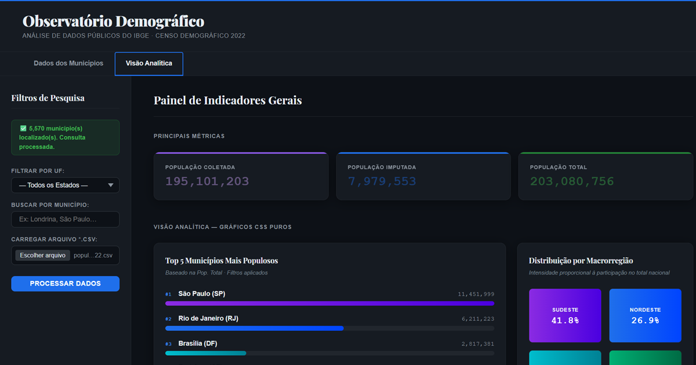

# Observatório Demográfico · IBGE Censo 2022

> Dashboard analítico que executa Python e Pandas **diretamente no navegador** via WebAssembly - sem backend, sem servidor, sem envio de dados.

🔗 **[Acesse a aplicação em produção](https://claitonoliveira.github.io/observatorio_demografico_s6/)**



---

## Scores Lighthouse (pós-otimização)

| Categoria | Score | Observação |
|---|---|---|
| Acessibilidade | **100 / 100** | WCAG 2.1 AA · ARIA semântico completo |
| SEO | **100 / 100** | Meta tags · Open Graph · dados estruturados |
| Boas Práticas | **81 / 100** | No GitHub Pages. Limitação estrutural: `SharedArrayBuffer` do Pyodide |
| Boas Práticas | **100 / 100** | No Netlify com o uso de Netlify Headers Isolation |
| Performance | **~70 / 100** | TBT elevado é inerente ao runtime WASM do PyScript |

> **Por que a Performance não é 100?** O PyScript carrega o interpretador Python completo (~13 MB entre Pyodide, stdlib e Pandas) via WebAssembly antes de qualquer interação. O ganho é rodar Python/Pandas no browser, sem API e sem servidor. Isso é discutido na disciplina como trade-off entre poder computacional e tempo de inicialização.

---

## Sobre o projeto

O **Observatório Demográfico** é uma Single Page Application que permite explorar os microdados populacionais do **Censo Demográfico 2022 do IBGE** a partir de um arquivo CSV carregado localmente pelo usuário. Todo o processamento acontece no dispositivo do usuário - nenhum dado é transmitido para servidores externos.

Desenvolvido como projeto didático ao longo da disciplina de **Programação Web Front-End com Python**, o projeto percorre progressivamente HTML semântico, CSS moderno, PyScript/WebAssembly, acessibilidade WCAG e qualidade de produção medida por auditoria Lighthouse.

### Funcionalidades

- **Filtro por UF** com seleção de todos os 26 estados e o Distrito Federal
- **Busca por município** com autocomplete via `<datalist>` nativo
- **Upload de CSV** com processamento client-side via Pandas no WASM
- **Cards de métricas** - população coletada, imputada e total
- **Tabela paginada** com 50 registros por página e navegação anterior/próximo
- **Ranking Top 5** municípios mais populosos com barras CSS alimentadas por Python
- **Heatmap de macrorregiões** com intensidade proporcional à participação populacional
- **Navegação por abas** com padrão WCAG 2.1 AA (`role="tablist"`, `aria-selected`, `tabindex` gerenciado)

---

## Stack tecnológica

| Camada | Tecnologia | Papel |
|---|---|---|
| Estrutura | HTML5 semântico | Landmarks, ARIA, tabpanel, caption |
| Estilo | CSS3 - Grid, Flexbox, Custom Properties | Layout, temas, gráficos sem canvas |
| Lógica | PyScript 2026.3.1 | Bridge Python ↔ DOM |
| Dados | Pandas 2.x (compilado para WASM) | Filtragem, agrupamento, ranking |
| Runtime | Pyodide 0.29 via WebAssembly | Interpretador CPython no browser |
| Qualidade | Google Lighthouse 13 | Auditoria de Performance, A11y, SEO |
| Deploy | GitHub Pages | Hospedagem estática (zero backend) |

### Por que CSS puro para os gráficos?

Os gráficos do Observatório não usam Canvas, SVG externo nem bibliotecas de visualização. O Python calcula os valores e injeta CSS Custom Properties (`--bar-width`, `--heat-opacity`) diretamente nos elementos via `element.style.setProperty()`. O CSS renderiza as barras e o heatmap a partir dessas variáveis. Isso demonstra a comunicação bidirecional entre Python e o modelo de estilo do navegador, um dos conceitos centrais da disciplina.

---

## Como executar localmente

**Pré-requisito:** qualquer servidor HTTP local. O PyScript não funciona via `file://` devido às políticas de CORS do browser para WebAssembly.

```bash
# Opção 1 - VS Code
# Instale a extensão Live Server e clique em "Go Live"

# Opção 2 - Python (sem dependências)
python -m http.server 5500

# Opção 3 - Node.js
npx serve .
```

Após iniciar o servidor, acesse `http://localhost:5500` (ou a porta indicada) e:

1. Aguarde a mensagem **"✅ Ambiente Python pronto!"** no painel lateral. O runtime WASM leva entre 5 e 15 segundos dependendo da conexão e do cache do browser.
2. Clique em **"Carregar arquivo \*.csv"** e selecione um arquivo do Censo 2022.
3. Clique em **"Processar Dados"** para ativar os filtros, a tabela e os gráficos.

---

## Onde obter os dados e como preparar o CSV

Os dados são públicos e estão disponíveis no FTP do IBGE:

```
https://ftp.ibge.gov.br/Censos/Censo_Demografico_2022/
  Populacao_e_domicilios_Primeiros_resultados/
  Resultados_da_2a_apuracao_20231027/
```

O arquivo esperado pela aplicação deve conter o layout de resultados populacionais por município, trazendo colunas como código do município, nome do município, UF, população coletada, imputada e total.

**⚠️ Instruções Importantes de Pré-processamento (Limpeza de Dados):**

Os arquivos disponibilizados pelo IBGE no FTP costumam vir nos formatos .ods (OpenDocument) ou .xlsx (Excel) e contêm elementos estruturais humanos que quebram o parsing automático do Pandas. Antes de exportar para CSV e carregar na aplicação, ajuste em um editor de planilhas (Excel, Calc ou Google Sheets) da seguinte forma:

1. **Remova o Cabeçalho Institucional:** Apague as linhas iniciais de título (ex: "Censo Demográfico 2022 - Primeiros Resultados...") para que a primeira linha real da planilha seja estritamente a linha com os nomes das colunas (UF, Código do Município, População total, etc.).

2. **Remova o Rodapé de Notas:** Vá até o final da planilha e delete as linhas de metadados, fontes e notas explicativas que ficam abaixo do último município.

3. **Garanta apenas Dados Limpos:** A tabela deve conter apenas a linha de cabeçalho técnico seguida imediatamente pelas linhas de registros dos municípios.

4. **Exportar:** Salve o resultado final explicitamente como CSV (separado por vírgulas ou ponto e vírgula) com codificação UTF-8.

---

## Estrutura do repositório

```
observatorio-demografico/
├── index.html          # Estrutura semântica e ARIA
├── style.css           # Identidade visual, layout, gráficos CSS
├── main.py             # Lógica Python: leitura, filtros, DOM, gráficos
├── images/
│   ├── favicon.ico
│   └── og-preview.png  # Card para compartilhamento social
└── README.md
```

---

## Contexto acadêmico

Este projeto foi desenvolvido na disciplina **Programação Web Front-End com Python** e percorreu as seguintes etapas ao longo das semanas:

| Semana | Conteúdo introduzido no projeto |
|---|---|
| 1–2 | HTML semântico, estrutura da página, primeiros estilos |
| 3 | Box Model, Flexbox, tabela de dados, painel de filtros |
| 4 | CSS Grid, SPA com abas ARIA, gráficos CSS puros, heatmap |
| 5 | Lighthouse, WCAG, contraste, meta tags, Open Graph |
| 6 | Deploy no GitHub Pages, README, encerramento do projeto |

---

## Licença e fontes

- **Código-fonte:** [MIT](LICENSE) - livre para uso, estudo e adaptação com atribuição
- **Dados:** domínio público - [Censo Demográfico 2022, IBGE · Diretoria de Pesquisas (DPE) · Coordenação Técnica do Censo (CTD)](https://ftp.ibge.gov.br/Censos/Censo_Demografico_2022/Populacao_e_domicilios_Primeiros_resultados/Resultados_da_2a_apuracao_20231027/)
